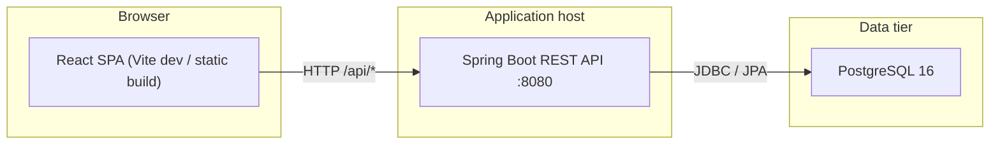
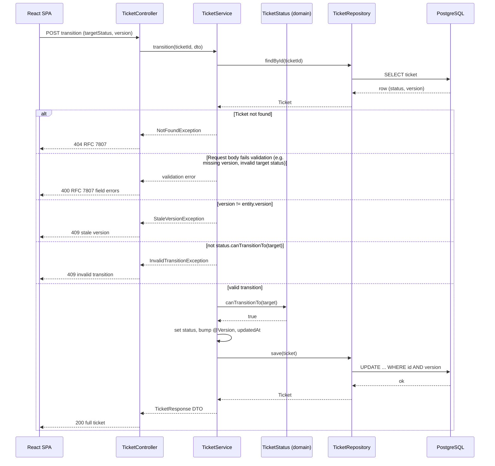

# Architecture — Support Ticket Management System

**Document status:** Draft (v0.1.0). Traces to `spec/requirements.md` (v0.4.0+).

## Purpose

Describe the system’s technical architecture, runtime topology, cross-cutting enforcement points, and key technology choices so implementation and tests align with FR/NFR IDs.

## Scope

- In scope: browser UI, REST API, PostgreSQL persistence, local dev layout, search/list behaviour, configuration and secrets, optimistic locking and error handling approach.
- Out of scope: authentication, deployment beyond local Docker Compose (see requirements §1).

## Content

### Overview

A **React SPA** talks to a **Spring Boot REST API**, which persists tickets and comments in **PostgreSQL**. The backend owns validation (NFR-02), the ticket status state machine (FR-09, NFR-07), optimistic locking (FR-11), and paginated list/search (FR-02, FR-06, FR-07, FR-08, NFR-06). The UI implements FR-12 against the same API; the server remains authoritative for all business rules.

### Component diagram

**Traceability:** NFR-01 (PostgreSQL persistence), FR-12 (UI), all FR-* API operations.

### Technology stack

| Layer | Technology | Version / notes |
|-------|------------|-----------------|
| Runtime | Java | 21 |
| Framework | Spring Boot | 3.x |
| Build | Maven | — |
| HTTP | Spring Web | — |
| Persistence | Spring Data JPA | — |
| Validation | Bean Validation (`jakarta.validation`) | On request DTOs |
| Migrations | Flyway | Schema SSOT in `db/migration` (see `spec/data-model.md`) |
| API docs | springdoc-openapi | OpenAPI 3 + Swagger UI |
| Database | PostgreSQL | 16 |
| Integration tests | Testcontainers, JUnit 5 | PostgreSQL container; `test` profile |
| Frontend | React, TypeScript | — |
| Frontend tooling | Vite | Dev server :5173 |
| Routing | React Router | — |
| Data fetching | TanStack Query | — |
| Frontend tests | Vitest, Testing Library | — |

**Traceability:** Decision 9 (requirements §7); NFR-01, NFR-04, NFR-05, NFR-07.

### Backend layering

Package layout follows `.cursor/rules/java-springboot.mdc`: `controller`, `service`, `repository`, `domain`, `dto`, `mapper`, `exception`, `config`.

| Layer | Responsibility | Requirement touchpoints |
|-------|----------------|-------------------------|
| **controller** | HTTP mapping, `@Valid` on bodies, delegate to services; return DTO records only | FR-01–FR-09, CRR-01–CRR-03 |
| **service** | Transactions, orchestration, invoke domain rules (transitions, terminal edits), optimistic-lock handling | FR-04, FR-09, FR-10, FR-11 |
| **repository** | Spring Data JPA access; custom queries / `JpaSpecificationExecutor` for search | FR-02, FR-06, FR-07, FR-08 |
| **domain** | JPA entities, `TicketStatus` (and related enums); transition rules owned by status enum | FR-09, `spec/state-machine.md` |
| **dto** | Request/response records; Bean Validation annotations | CRR-04, NFR-02 |
| **mapper** | Entity ↔ DTO mapping; no HTTP or persistence logic | FR-03 (comments ordering in service or query) |
| **exception** | Domain exceptions; `@RestControllerAdvice` maps to RFC 7807 Problem Details | Decision 10–11, NFR-02, NFR-03 |
| **config** | DataSource, Flyway, OpenAPI, profiles (`default`, `test`) | NFR-04, NFR-07 |

Controllers stay thin: no business logic, never expose entities.

### Where rules are enforced

| Concern | Location | Requirements |
|---------|----------|--------------|
| Status transitions | `TicketStatus` enum defines allowed targets (e.g. `canTransitionTo(target)`); **service** loads ticket, checks version, calls enum, persists | FR-09, FR-10, NFR-07; SSOT: `spec/state-machine.md` |
| Input validation | Bean Validation on **DTOs**; additional domain invariants in **service** (e.g. terminal ticket field update) | CRR-04, FR-01, FR-04, FR-05, FR-07, NFR-02 |
| Optimistic locking | JPA `@Version` on ticket entity; stale write → conflict exception → **409** | FR-11, FR-09-AC9, FR-04 (with version) |
| Error mapping | Central **`@RestControllerAdvice`** → RFC 7807 (`application/problem+json`) with field errors array where applicable | Decision 10, NFR-02-AC2, FR-12-AC9 |

Invalid transitions and terminal-ticket edits map to **409** with distinct Problem Details `type` values (decision 11; URIs in `spec/api-contract.md`).

### Search and list

- **Keyword (FR-06):** Case-insensitive literal substring match on `title` and `description` via JPA **Specification** (or JPQL with `LOWER(column) LIKE LOWER(:pattern)`); escape `%` and `_` in the keyword (FR-06-AC7). Keyword trimmed; omitted/blank/whitespace-only → no keyword predicate.
- **Status filter (FR-07):** Single status value; invalid enum → 400.
- **Combination:** Keyword and status filters are **AND**ed (FR-06-AC4, FR-07-AC3).
- **Pagination (FR-08):** Spring `Pageable`; default sort `createdAt` descending; page size default 20, max 100, page index from 0.

**Traceability:** FR-02, FR-06, FR-07, FR-08, NFR-06.

### Configuration and secrets

| Item | Approach |
|------|----------|
| DB URL, user, password | Environment variables (e.g. `SPRING_DATASOURCE_*` or project-specific names documented in `.env.example`) |
| Local Compose | `docker-compose.yml` reads from `.env` (git-ignored) |
| Committed template | `.env.example` with placeholders only (NFR-04-AC2) |
| Profiles | **`default`**: PostgreSQL (Compose or external); **`test`**: Testcontainers PostgreSQL, Flyway migrations applied in tests |

No credentials in source or committed config (NFR-04).

### Local run topology

| Process | Port | Notes |
|---------|------|--------|
| PostgreSQL | 5432 (typical) | Docker Compose; **named volume** for data (NFR-01) |
| Spring Boot API | 8080 | REST under `/api` (paths in `spec/api-contract.md`) |
| Vite dev server | 5173 | Proxies `/api` to backend so the browser uses same origin in dev—**no CORS configuration required for local dev** |

**Traceability:** NFR-01, FR-12 (local UI workflows).

### Persistence across restart

PostgreSQL data is stored on a **named Docker volume** attached to the database service so graceful restarts of the DB or app containers preserve tickets and comments (NFR-01-AC1).

### Sequence: status transition

Covers success, invalid transition, and stale version paths (FR-09, FR-11).

Request handling order for PATCH and transition follows requirements **decision 13**: 404 → 400 (validation) → 409 stale `version` → 409 terminal edit or invalid transition. Malformed JSON and CRR-03 unknown properties may be rejected at the controller boundary before the service runs.

**Stale detection (FR-11):** The service compares the request `version` to the loaded entity first. If another client updates the ticket between read and `save`, JPA `@Version` can still raise `OptimisticLockException`; map that to the same **409** stale-version `type` as an explicit version mismatch.

PATCH and comment flows follow the same layering; PATCH adds terminal-status check (FR-04-AC3) after stale-version check per decision 13.

### Architecture Decision Records

#### ADR-001: React + Vite instead of Next.js

- **Context:** FR-12 requires a SPA against a separate REST API; no SSR or file-based routing requirement; auth is out of scope.
- **Decision:** React with TypeScript and Vite for fast dev, simple static deploy, and explicit client-side routing (React Router).
- **Consequences:** No server components; API base URL via Vite proxy in dev; TanStack Query for server state.

#### ADR-002: Flyway for schema management

- **Context:** NFR-01, NFR-07 need a stable PostgreSQL schema in dev and CI.
- **Decision:** Flyway versioned SQL migrations; JPA `ddl-auto` not used for production-like profiles.
- **Consequences:** Schema changes are reviewable SQL; aligns with `spec/data-model.md` migration plan.

#### ADR-003: HTTP 409 for business conflicts

- **Context:** Decision 11; stale version, invalid transition, terminal ticket edit.
- **Decision:** Use **409 Conflict** with distinct RFC 7807 `type` URIs for stale version vs invalid transition vs terminal edit.
- **Consequences:** UI can branch on `type` (FR-12-AC11–AC13); distinct from 400 validation errors.

#### ADR-004: JPA `@Version` for optimistic locking

- **Context:** FR-11; version starts at 0 on create (FR-01-AC1).
- **Decision:** Map `version` column to `@Version` on the ticket entity; increment on successful PATCH and transition.
- **Consequences:** JPA detects concurrent updates; service maps `OptimisticLockException` (or equivalent) to stale-version 409.

#### ADR-005: Testcontainers PostgreSQL over H2 for integration tests

- **Context:** NFR-07 requires real HTTP + DB behaviour (CHECK constraints, PostgreSQL types, Flyway).
- **Decision:** Integration tests use Testcontainers PostgreSQL and the `test` profile with Flyway.
- **Consequences:** Slower tests than in-memory H2 but faithful to NFR-01 and FR-06 search semantics.

## Open Questions

None. Endpoint and Problem Details URI details remain in `spec/api-contract.md` (requirements §7).

## Change Log

| Date | Version | Author | Summary |
|------|---------|--------|---------|
| 2026-09-30 | 0.1.0 | — | Initial architecture spec (stack, layering, enforcement, search, config, topology, sequence diagram, ADRs). |
| 2026-09-30 | 0.1.1 | — | Transition sequence 400 alt; decision 13 note; stale detection (explicit version + OptimisticLockException); FR-06 literal escape. |
