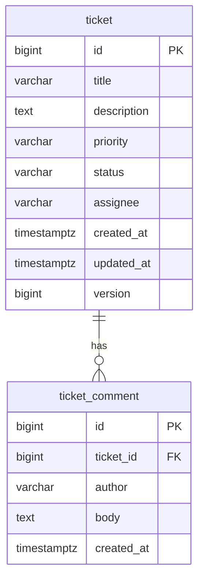

# Data Model — Support Ticket Management System

**Document status:** Draft (v0.1.0). Traces to `spec/requirements.md` (v0.4.0+). JSON field names and API shapes: `spec/api-contract.md`.

## Purpose

Define the relational schema, indexes, entity mapping, DTO field sets at a high level, and Flyway migration plan for tickets and comments.

## Scope

- In scope: `ticket`, `ticket_comment` tables; constraints matching FR-01, FR-03–FR-05; optimistic locking column; Flyway V1–V2.
- Out of scope: users, attachments, soft delete, audit tables.

## Content

### Entity-relationship diagram

**Traceability:** FR-01, FR-03, FR-05; ticket 1—* comments (FR-03-AC2).

### Table: `ticket`

| Column | SQL type | Nullable | Constraints / default | Requirements |
|--------|----------|----------|------------------------|--------------|
| `id` | `BIGSERIAL` | NO | PRIMARY KEY | FR-01 (system id) |
| `title` | `VARCHAR(200)` | NO | length 3–200 enforced in API (Bean Validation) | FR-01-AC4 |
| `description` | `TEXT` | NO | max 5000 chars in API | FR-01-AC5 |
| `priority` | `VARCHAR(20)` | NO | CHECK in (`LOW`, `MEDIUM`, `HIGH`, `CRITICAL`); DEFAULT `MEDIUM` | FR-01-AC2, FR-01-AC6 |
| `status` | `VARCHAR(20)` | NO | CHECK in (`OPEN`, `IN_PROGRESS`, `RESOLVED`, `CLOSED`, `CANCELLED`); DEFAULT `OPEN` on insert | FR-01-AC1, FR-09 |
| `assignee` | `VARCHAR(100)` | YES | null = unassigned | FR-01-AC2, FR-01-AC3 |
| `created_at` | `TIMESTAMPTZ` | NO | UTC; set on create | FR-01-AC1 |
| `updated_at` | `TIMESTAMPTZ` | NO | UTC; set on create and on successful update/transition | FR-04-AC1, FR-09 |
| `version` | `BIGINT` | NO | NOT NULL; DEFAULT `0`; optimistic lock | FR-01-AC1, FR-11 |

Application layer sets `created_at` / `updated_at` in UTC; database defaults may mirror insert-time behaviour for migrations.

**API vs database validation:** The database enforces `NOT NULL`, column max lengths, and enum `CHECK` constraints where defined. Minimum lengths (e.g. title ≥3) and non-blank text (title, description, comment body) are enforced at the **API layer** only (Bean Validation per FR-01, FR-05).

### Table: `ticket_comment`

| Column | SQL type | Nullable | Constraints / default | Requirements |
|--------|----------|----------|------------------------|--------------|
| `id` | `BIGSERIAL` | NO | PRIMARY KEY | FR-05 |
| `ticket_id` | `BIGINT` | NO | FOREIGN KEY → `ticket(id)`; ON DELETE RESTRICT (no ticket delete in scope) | FR-05-AC1 |
| `author` | `VARCHAR(100)` | NO | max 100 in API | FR-05-AC2 |
| `body` | `TEXT` | NO | 1–2000 chars in API | FR-05-AC3 |
| `created_at` | `TIMESTAMPTZ` | NO | UTC; set on create | FR-05-AC1, FR-03-AC2 |

Comments are append-only (no `updated_at`).

### Indexes

| Index | Columns | Rationale |
|-------|---------|-----------|
| `idx_ticket_status` | `ticket(status)` | Status filter (FR-07) |
| `idx_ticket_created_at` | `ticket(created_at DESC)` or `(created_at)` | Default list sort `createdAt` desc (FR-02-AC1, FR-08-AC2) |
| `idx_ticket_comment_ticket_created` | `ticket_comment(ticket_id, created_at)` | Detail view: comments chronological (FR-03-AC2) |

**Search (FR-06):** Case-insensitive literal substring on `title` and `description` via `LOWER(...) LIKE` with escaped `%` / `_` in the keyword. Acceptable at expected POC scale. **Not implemented:** `pg_trgm` GIN indexes—future optimisation if volume grows.

### Entity ↔ table mapping

| JPA entity | Table | Notes |
|------------|-------|--------|
| `Ticket` | `ticket` | `@Version` on `version`; enums `TicketStatus`, `TicketPriority` mapped to `varchar` |
| `TicketComment` | `ticket_comment` | `@ManyToOne` to `Ticket`; lazy load or fetch join per detail query |

### DTO shapes (field names only)

API JSON naming (camelCase) is normative in `spec/api-contract.md`. Logical fields:

| DTO | Fields |
|-----|--------|
| **CreateTicketRequest** | `title`, `description`, `priority` (optional), `assignee` (optional) |
| **UpdateTicketRequest** | `version`, `title`, `description`, `priority`, `assignee` (partial; at least one mutable field besides `version`) |
| **TransitionRequest** | `version`, `status` (target) |
| **CreateCommentRequest** | `author`, `body` |
| **TicketResponse** (detail) | `id`, `title`, `description`, `priority`, `status`, `assignee`, `createdAt`, `updatedAt`, `version`, `comments` (always present; **empty array** when none) |
| **CommentResponse** | `id`, `author`, `body`, `createdAt` |
| **TicketSummary** (list item) | Ticket fields including `version`; **never** includes `comments` (exact field set in `spec/api-contract.md`) |

**Traceability:** CRR-03 (forbidden properties on create/PATCH), FR-03, FR-04, FR-09.

### Flyway migration plan

| Version | File | Contents |
|---------|------|----------|
| V1 | `V1__create_ticket.sql` | `ticket` table, CHECK constraints for `status` and `priority`, defaults, indexes `idx_ticket_status`, `idx_ticket_created_at` |
| V2 | `V2__create_ticket_comment.sql` | `ticket_comment` table, FK to `ticket`, index `idx_ticket_comment_ticket_created` |

Migrations are the schema SSOT (ADR-002 in `spec/architecture.md`); JPA entities align with these scripts.

## Open Questions

None.

## Change Log

| Date | Version | Author | Summary |
|------|---------|--------|---------|
| 2026-09-30 | 0.1.0 | — | Initial data model (ER diagram, tables, indexes, mapping, Flyway V1–V2). |
| 2026-09-30 | 0.1.1 | — | API vs DB validation note; detail/list response shapes; FR-06 literal search. |
