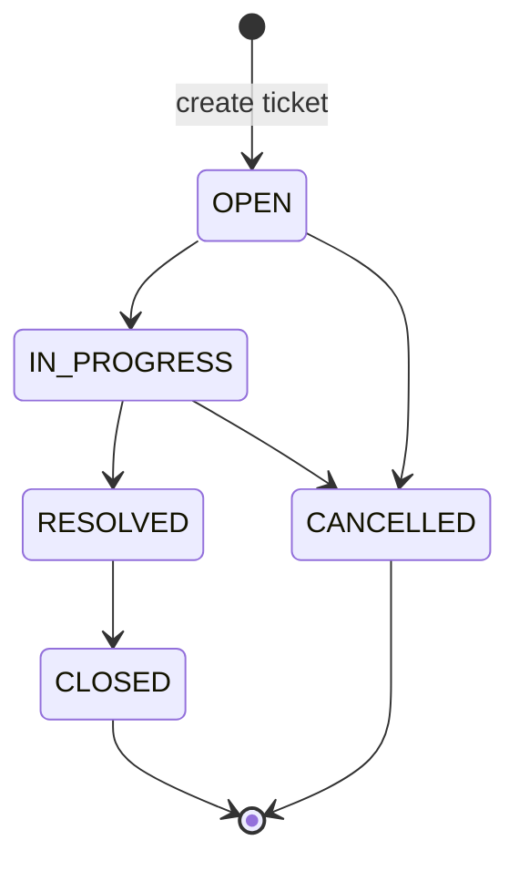

# Support Ticket Management System — Requirements

**Document status:** Baselined (v0.4.0). Frozen until implementation feedback requires changes.

## 1. Purpose & Scope

### Purpose

Define functional and non-functional requirements for a **Support Ticket Management System** that lets users create and manage support tickets, add comments, search and filter tickets, and change ticket status through a backend-enforced lifecycle. Data is stored in **PostgreSQL** and survives application restarts.

### In Scope

- Ticket CRUD-style operations: create, list, view details, update selected fields (not status via general update).
- Comments on tickets (append-only).
- Keyword search and status filtering, with paginated results.
- Status changes only through a dedicated transition operation governed by a fixed state machine.
- Backend input validation with errors surfaced meaningfully in the UI.
- Optimistic locking for concurrent edits.
- Persistent storage in PostgreSQL.
- Web UI for ticket workflows (FR-12).

**Related specs (pending):** `architecture.md`, `data-model.md`, `api-contract.md`, `state-machine.md`, `ui-flow.md`, `test-strategy.md`.

### Out of Scope

- Authentication and authorisation.
- User management (no user accounts, roles, or permissions model).
- File attachments on tickets or comments.
- Notifications (email, push, webhooks).
- Deleting tickets (hard or soft delete).
- Editing or deleting comments.

---

## 2. Glossary

| Term | Definition |
|------|------------|
| **Ticket** | A support record with metadata (title, description, priority, status, assignee, timestamps) and an associated comment thread. |
| **Comment** | An immutable message attached to a ticket, with author and body. |
| **Status** | One of: `OPEN`, `IN_PROGRESS`, `RESOLVED`, `CLOSED`, `CANCELLED`. Set only via status transition; new tickets are always `OPEN`. |
| **Priority** | One of: `LOW`, `MEDIUM`, `HIGH`, `CRITICAL`. Default on create: `MEDIUM`. |
| **Terminal status** | `CLOSED` or `CANCELLED`. Ticket field updates are rejected; comments remain allowed. |
| **Status transition** | An explicit operation that changes `status` according to the state machine. |
| **General field update** | An operation that updates title, description, priority, and/or assignee but not status. |
| **Optimistic locking** | Concurrency control using a version (or equivalent); updates based on stale version are rejected. |
| **Keyword search** | Case-insensitive **substring** match of a search term against ticket **title** and **description**. |

---

## 3. Functional Requirements

Each requirement includes acceptance criteria in **Given / When / Then** form. Negative cases are included where relevant. **Decision 10** (§7) defines error body format; **decision 11** defines HTTP status codes.

### Ticket data model (reference)

| Field | Rules |
|-------|--------|
| `id` | Numeric, system-generated, stable identifier. Path id errors: **Common request rules**. |
| `title` | Required; 3–200 characters. |
| `description` | Required; max 5000 characters. |
| `priority` | `LOW`, `MEDIUM`, `HIGH`, `CRITICAL`; default `MEDIUM` on create. |
| `status` | Always `OPEN` on creation; must not be settable on create. |
| `assignee` | Optional; free text up to 100 characters (no email format validation). Empty string on create or PATCH is stored as null. |
| `createdAt` | Set by system on create. |
| `updatedAt` | Set by system on create and on successful updates. |
| `version` | Integer; **0 on create**; exposed on ticket responses; required in PATCH and status transition requests; incremented on successful PATCH or transition (see FR-11). |

### Comment data model (reference)

| Field | Rules |
|-------|--------|
| `author` | Required; max 100 characters. |
| `body` | Required; 1–2000 characters. |
| `createdAt` | Set by system on create. |

Comments cannot be edited or deleted. Comments are allowed in any ticket status, including terminal statuses.

### Common request rules (apply to all endpoints)

Applies to every API operation unless an FR states otherwise. FR-01, FR-04, FR-05, and FR-09 reference these rules instead of repeating the same acceptance criteria.

| ID | Given | When | Then |
|----|-------|------|------|
| CRR-01 | Request includes a ticket id in the path | Path id is non-numeric | HTTP 400 (decision 11) |
| CRR-02 | Request includes a ticket id in the path | Path id is well-formed numeric but no ticket exists | HTTP 404 (decision 11) |
| CRR-03 | Request has a JSON body (create, PATCH, transition, comment) | Body includes unknown or forbidden properties (e.g. `status` on create, `id` / `createdAt` on PATCH) | HTTP 400 (decision 11); no partial apply |
| CRR-04 | Request violates field validation rules in this spec | Request is rejected for validation | HTTP 400 with RFC 7807 field-level errors (decision 10) |

---

### FR-01 — Create ticket

**Description:** A client can create a ticket with title and description; optional priority and assignee; status is always `OPEN`. Request body errors: **Common request rules** (CRR-03, CRR-04).

| ID | Given | When | Then |
|----|-------|------|------|
| FR-01-AC1 | Valid title (3–200 chars) and description (≤5000) | Client creates a ticket | Ticket persisted with `status` = `OPEN`, `version` = **0**, default `priority` = `MEDIUM` if omitted; response body is the **full ticket** including `id`, `status`, `version`, `createdAt`, `updatedAt` |
| FR-01-AC2 | Valid payload with optional `priority` and assignee | Client creates a ticket | Stored values match input; omitted assignee → null; `assignee` `""` → null (FR-01-AC3) |
| FR-01-AC3 | Valid create payload with `assignee` empty string | Client creates a ticket | Assignee stored as null |
| FR-01-AC4 | Title missing, too short (<3), or too long (>200) | Client creates a ticket | CRR-04 |
| FR-01-AC5 | Description missing or length >5000 | Client creates a ticket | CRR-04 |
| FR-01-AC6 | Invalid `priority` value | Client creates a ticket | CRR-04 |
| FR-01-AC7 | Assignee length >100 | Client creates a ticket | CRR-04 |

---

### FR-02 — List tickets

**Description:** A client can retrieve a paginated list of tickets.

| ID | Given | When | Then |
|----|-------|------|------|
| FR-02-AC1 | Multiple tickets exist | Client lists tickets with default parameters | Paginated result returned; default sort `createdAt` descending |
| FR-02-AC2 | No tickets exist | Client lists tickets | Empty page returned (not an error) |
| FR-02-AC3 | List request includes pagination parameters | Client lists tickets | Default page size 20; maximum page size 100; page numbering starts at 0 (see FR-08) |

---

### FR-03 — View ticket details

**Description:** A client can retrieve a single ticket including its fields and comments in chronological order. Path id errors: **Common request rules** (CRR-01, CRR-02).

| ID | Given | When | Then |
|----|-------|------|------|
| FR-03-AC1 | Ticket exists | Client requests ticket by numeric id | Full ticket details returned including `version` and comments |
| FR-03-AC2 | Ticket has multiple comments | Client requests ticket by id | Comments ordered by `createdAt` ascending (oldest first) |

---

### FR-04 — Update ticket fields (not status)

**Description:** A client can partially update (PATCH) title, description, priority, and assignee on non-terminal tickets. Omitted fields remain unchanged. `version` is required; the body must include **at least one mutable field** besides `version`. Path and body errors: **Common request rules**.

| ID | Given | When | Then |
|----|-------|------|------|
| FR-04-AC1 | Ticket in `OPEN`, `IN_PROGRESS`, or `RESOLVED` | Client PATCHes one or more allowed fields with valid values and current `version` | Provided fields updated; omitted fields unchanged; `updatedAt` refreshed; `version` incremented |
| FR-04-AC2 | Invalid title, description, priority, or assignee (same rules as create) | Client PATCHes with current `version` | CRR-04 |
| FR-04-AC3 | Ticket in `CLOSED` or `CANCELLED` | Client PATCHes any ticket field with current `version` | HTTP 409; Problem Details `type` identifies terminal-ticket edit (decision 11); fields unchanged |
| FR-04-AC4 | Non-terminal ticket with existing assignee | Client PATCHes `assignee` to a new valid value with current `version` | Assignee updated to new value |
| FR-04-AC5 | Non-terminal ticket with assignee set | Client PATCHes `assignee` to empty string with current `version` | Assignee stored as null |
| FR-04-AC6 | Ticket in `CLOSED` or `CANCELLED` | Client PATCHes `assignee` only with current `version` | HTTP 409; terminal-ticket edit `type`; assignee unchanged |
| FR-04-AC7 | PATCH request omits `version` | Client PATCHes | HTTP 400 (decision 11) |
| FR-04-AC8 | PATCH sets `title`, `description`, or `priority` to null | Client PATCHes with current `version` | CRR-04 |
| FR-04-AC9 | PATCH body contains only `version` (no mutable field) | Client PATCHes | HTTP 400 (decision 11) |

---

### FR-05 — Add comment

**Description:** A client can append a comment to an existing ticket in any status. Path and body errors: **Common request rules**.

| ID | Given | When | Then |
|----|-------|------|------|
| FR-05-AC1 | Ticket exists (any status) | Client adds comment with valid author and body (no ticket `version` required) | Comment persisted with `createdAt`; visible on ticket detail |
| FR-05-AC2 | Author missing or length >100 | Client adds comment | CRR-04 |
| FR-05-AC3 | Body missing, empty, or length >2000 | Client adds comment | CRR-04 |

---

### FR-06 — Search tickets by keyword

**Description:** Case-insensitive **substring** keyword search on title and description.

| ID | Given | When | Then |
|----|-------|------|------|
| FR-06-AC1 | Tickets with varying title/description text | Client searches with keyword as substring of title only (any case) | Matching tickets included in results |
| FR-06-AC2 | Same corpus | Client searches with keyword as substring of description only (any case) | Matching tickets included |
| FR-06-AC3 | Keyword matches neither title nor description | Client searches | Ticket excluded from results |
| FR-06-AC4 | Search combined with status filter (FR-07) | Client searches with both parameters | Only tickets matching keyword **and** status |
| FR-06-AC5 | Keyword query parameter omitted, blank, or whitespace-only | Client lists or searches | No keyword filter applied; normal paginated list (FR-08) |
| FR-06-AC6 | Keyword with leading/trailing whitespace | Client searches | Keyword trimmed before case-insensitive substring match on title and description |

---

### FR-07 — Filter tickets by status

**Description:** List/search can be restricted by a single status value.

| ID | Given | When | Then |
|----|-------|------|------|
| FR-07-AC1 | Tickets in multiple statuses | Client filters by `OPEN` | Only `OPEN` tickets returned (subject to pagination/search) |
| FR-07-AC2 | Invalid status filter value | Client filters | HTTP 400 with RFC 7807 Problem Details |
| FR-07-AC3 | Tickets in multiple statuses; no keyword | Client lists with valid single status filter only | Paginated list contains only tickets in that status |

---

### FR-08 — Pagination and default sort

**Description:** Search and list results are paginated; default sort is `createdAt` descending.

| ID | Given | When | Then |
|----|-------|------|------|
| FR-08-AC1 | More tickets than default page size | Client requests page 0 with defaults | Page contains at most 20 items; page numbering starts at 0; maximum page size 100 |
| FR-08-AC2 | Client omits sort | Client lists or searches | Results ordered by `createdAt` descending |
| FR-08-AC3 | `page` &lt; 0, `size` &lt; 1, `size` &gt; 100, or non-numeric pagination params | Client lists or searches | HTTP 400 with RFC 7807 Problem Details |
| FR-08-AC4 | Client requests a page index beyond the last page | Client lists or searches | HTTP 200 with an empty content list; pagination metadata per `spec/api-contract.md` |

---

### FR-09 — Status transition

**Description:** Status changes only via a dedicated transition operation with current ticket `version`; backend enforces the state machine (Section 4). Path and body errors: **Common request rules**.

| ID | Given | When | Then |
|----|-------|------|------|
| FR-09-AC1 | Ticket in `OPEN` at version *V* | Client transitions to `IN_PROGRESS` with `version` *V* | Status becomes `IN_PROGRESS`; `updatedAt` updated; `version` incremented |
| FR-09-AC2 | Ticket in `IN_PROGRESS` at version *V* | Client transitions to `RESOLVED` with `version` *V* | Status becomes `RESOLVED`; `updatedAt` updated; `version` incremented |
| FR-09-AC3 | Ticket in `RESOLVED` at version *V* | Client transitions to `CLOSED` with `version` *V* | Status becomes `CLOSED`; `updatedAt` updated; `version` incremented |
| FR-09-AC4 | Ticket in `OPEN` at version *V* | Client transitions to `CANCELLED` with `version` *V* | Status becomes `CANCELLED`; `updatedAt` updated; `version` incremented |
| FR-09-AC5 | Ticket in `IN_PROGRESS` at version *V* | Client transitions to `CANCELLED` with `version` *V* | Status becomes `CANCELLED`; `updatedAt` updated; `version` incremented |
| FR-09-AC6 | Current status equals requested target (e.g. `OPEN` → `OPEN`) | Client requests transition with current `version` | HTTP 409; invalid transition `type` (decision 11); status unchanged |
| FR-09-AC7 | Disallowed transition (see Section 4) | Client requests transition with current `version` | HTTP 409; invalid transition `type`; status unchanged |
| FR-09-AC8 | Transition request omits `version` | Client requests transition | HTTP 400 (decision 11) |
| FR-09-AC9 | Transition submitted with stale `version` | Client requests transition | HTTP 409; stale version `type`; status unchanged |

---

### FR-10 — Terminal status behaviour

**Description:** `CLOSED` and `CANCELLED` are terminal for field updates; comments still allowed.

| ID | Given | When | Then |
|----|-------|------|------|
| FR-10-AC1 | Ticket `CLOSED` | Client adds comment | Comment accepted (FR-05) |
| FR-10-AC2 | Ticket `CANCELLED` | Client adds comment | Comment accepted |
| FR-10-AC3 | Ticket `CLOSED` or `CANCELLED` | Client attempts status transition with current `version` | HTTP 409; Problem Details `type` identifies invalid transition (FR-09-AC7) |
| FR-10-AC4 | Ticket terminal | Client attempts field update | HTTP 409; terminal-ticket edit `type` (FR-04-AC3) |

---

### FR-11 — Optimistic locking

**Description:** Concurrent edits use optimistic locking; stale updates are rejected with a clear error.

| ID | Given | When | Then |
|----|-------|------|------|
| FR-11-AC1 | Client A successfully updates at version *V* | Client B submits PATCH still using version *V* | HTTP 409; Problem Details `type` identifies stale version; A's changes remain |
| FR-11-AC2 | Client A successfully transitions at version *V* | Client B submits transition still using version *V* | HTTP 409; Problem Details `type` identifies stale version; status unchanged by B |

---

### FR-12 — User interface

**Description:** The web UI implements end-user flows against the API. The UI may restrict choices (e.g. transition buttons) for usability; the backend remains authoritative for validation and state rules.

| ID | Given | When | Then |
|----|-------|------|------|
| FR-12-AC1 | User is on the create-ticket view | User submits valid title and description (and optional priority/assignee) | Ticket is created via API; UI navigates to the new ticket's detail page |
| FR-12-AC2 | Tickets exist | User opens the ticket list | Tickets are shown from the list API with default pagination and sort |
| FR-12-AC3 | Ticket exists | User opens a ticket | Detail view shows fields and comments in chronological order |
| FR-12-AC4 | Non-terminal ticket on detail view | User edits title, description, priority, and/or assignee and saves | PATCH sent with current `version`; UI reflects successful update |
| FR-12-AC5 | Ticket on detail view (any status) | User adds a comment with author and body | Comment appears in the thread after successful POST |
| FR-12-AC6 | Tickets exist | User enters a keyword and searches | Results show case-insensitive substring matches on title/description |
| FR-12-AC7 | Tickets in multiple statuses | User selects a status filter | List/search shows only tickets in that status |
| FR-12-AC8 | Ticket on detail view in a non-terminal status | User performs a status transition | UI offers only transitions valid for the current status (including **RESOLVED → CLOSED**); on submit, transition API is called; UI updates to new status on success |
| FR-12-AC9 | Backend returns HTTP 400 with RFC 7807 field errors | User submits a form | Field-level messages appear next to the affected fields |
| FR-12-AC10 | Backend returns HTTP 404 | User action targets missing ticket | Clear not-found message shown |
| FR-12-AC11 | Backend returns HTTP 409 (invalid transition `type`) | User attempts transition | Clear message explaining transition is not allowed |
| FR-12-AC12 | Backend returns HTTP 409 (terminal-ticket edit `type`) | User attempts field update on terminal ticket | Clear message that the ticket cannot be edited |
| FR-12-AC13 | Backend rejects stale `version` (HTTP 409) | User submits update or transition | Clear message prompting user to reload and retry |
| FR-12-AC14 | Ticket in `CLOSED` or `CANCELLED` on detail view | User views the ticket | Field editing and status actions are disabled; adding comments remains available |

---

## 4. State Machine Requirement

Summary of ticket lifecycle rules (full detail will move to `state-machine.md`; see **Deferred to state-machine.md** below).

Status values: `OPEN`, `IN_PROGRESS`, `RESOLVED`, `CLOSED`, `CANCELLED`.

### Allowed transitions

| From \\ To | IN_PROGRESS | RESOLVED | CLOSED | CANCELLED |
|------------|-------------|----------|--------|-----------|
| **OPEN** | Yes | No | No | Yes |
| **IN_PROGRESS** | No | Yes | No | Yes |
| **RESOLVED** | No | No | Yes | No |
| **CLOSED** | No | No | No | No |
| **CANCELLED** | No | No | No | No |

Linear happy path: `OPEN` → `IN_PROGRESS` → `RESOLVED` → `CLOSED`.

Cancellation path: `OPEN` → `CANCELLED`; `IN_PROGRESS` → `CANCELLED`.

### Mermaid view

### Explicitly rejected transition examples

| Current status | Requested status | Result |
|----------------|------------------|--------|
| `CLOSED` | `OPEN` | Rejected (409, invalid transition) |
| `RESOLVED` | `OPEN` | Rejected (409, invalid transition) |
| `CANCELLED` | `OPEN` | Rejected (409, invalid transition) |
| `CLOSED` | `IN_PROGRESS` | Rejected (409, invalid transition) |
| `RESOLVED` | `IN_PROGRESS` | Rejected (409, invalid transition) |
| `OPEN` | `RESOLVED` | Rejected (409, invalid transition) (must go via `IN_PROGRESS`) |
| `OPEN` | `CLOSED` | Rejected (409, invalid transition) |
| `IN_PROGRESS` | `CLOSED` | Rejected (409, invalid transition) (must go via `RESOLVED`) |
| `RESOLVED` | `CANCELLED` | Rejected (409, invalid transition) |
| Any | Same as current (e.g. `OPEN` → `OPEN`) | Rejected (409, invalid transition) |

---

## 5. Non-Functional Requirements

### NFR-01 — Persistence across restart

| ID | Given | When | Then |
|----|-------|------|------|
| NFR-01-AC1 | Tickets and comments stored in PostgreSQL (Docker Compose at runtime) | Application or database container restarts (graceful) | Previously stored tickets and comments are still retrievable with unchanged content |

### NFR-02 — Backend validation

| ID | Given | When | Then |
|----|-------|------|------|
| NFR-02-AC1 | Invalid input per FR rules or CRR-04 | Request reaches backend | Backend rejects request; does not persist invalid data |
| NFR-02-AC2 | Validation failure | Backend responds | RFC 7807 Problem Details with a field errors array (see `spec/api-contract.md`) |

### NFR-03 — Meaningful errors in UI

| ID | Given | When | Then |
|----|-------|------|------|
| NFR-03-AC1 | Backend returns validation, not-found, conflict, or transition errors | UI presents outcome to user | User sees a clear message tied to the failure (field errors, not found, invalid transition, stale version, terminal edit) |

### NFR-04 — No secrets committed

| ID | Given | When | Then |
|----|-------|------|------|
| NFR-04-AC1 | Repository and configuration practices | Credentials or API keys exist for local/dev use | They are not committed to version control; documentation describes safe configuration (e.g. env vars, ignored local files) |
| NFR-04-AC2 | Repository layout | Developer clones the project | `.env` files are git-ignored; a committed `.env.example` documents required variables with placeholder values only |

### NFR-05 — Testability

| ID | Given | When | Then |
|----|-------|------|------|
| NFR-05-AC1 | Implemented system | Automated tests run against API/domain | Tests can verify FR and state machine rules without manual-only steps |
| NFR-05-AC2 | Requirements IDs | Tests or tasks documented | Traceability to FR/NFR IDs where applicable |

### NFR-06 — Bounded list/search responses

| ID | Given | When | Then |
|----|-------|------|------|
| NFR-06-AC1 | Large number of tickets | Client calls a list or search endpoint | Response is a single bounded page (at most 100 items per request); the full dataset is never returned in one response |

### NFR-07 — State machine integration tests

| ID | Given | When | Then |
|----|-------|------|------|
| NFR-07-AC1 | Backend integration test suite with Testcontainers PostgreSQL | Tests run against the real HTTP API and database | Every **allowed** transition in Section 4 is exercised and passes |
| NFR-07-AC2 | Same suite | Tests run | All **25** from→to cells in the status × status matrix are exercised; each test asserts its **expected outcome** (success for the **5 allowed** transitions; HTTP **409** for the **20 rejected**, including **5 same-status** pairs) |
| NFR-07-AC3 | CI/build pipeline | Any state-machine integration test fails | Build fails |

---

## 6. Traceability

### Assignment core acceptance criteria

| Assignment core acceptance criterion | FR / NFR |
|--------------------------------------|----------|
| Ticket can be created from UI | FR-12-AC1, FR-01 |
| Tickets can be listed | FR-12-AC2, FR-02, FR-08 |
| Ticket details can be viewed | FR-12-AC3, FR-03 |
| Ticket fields can be updated | FR-12-AC4, FR-04 |
| Assignee can be changed | FR-04-AC4, FR-04-AC5, FR-12-AC4 |
| Comments can be added | FR-12-AC5, FR-05, FR-10 |
| Search works | FR-12-AC6, FR-06, FR-08 |
| Status filter works | FR-12-AC7, FR-07 |
| Valid status transitions work | FR-12-AC8, FR-09, Section 4 |
| Invalid status transitions are rejected by backend | FR-09-AC6, FR-09-AC7, Section 4, NFR-07 |
| Data survives application restart | NFR-01 |
| Backend validation works | NFR-02, CRR-04, FR-* validation ACs |
| UI shows meaningful errors | FR-12-AC9–FR-12-AC13, FR-12-AC14, NFR-03 |
| State-machine integration tests pass | NFR-07 |
| No secrets are committed | NFR-04, NFR-04-AC2 |

### Design decisions

| Design decision | FR / NFR |
|-----------------|----------|
| Ticket field limits and defaults (title 3–200, description ≤5000, priority enum default MEDIUM, status OPEN on create, `version` 0 on create, timestamps, system numeric `id`) | FR-01, data model §3 |
| Assignee optional free text ≤100; no email format validation; omitted or `""` on create/PATCH → null | FR-01-AC2, FR-01-AC3, FR-04-AC4–FR-04-AC5, data model §3 |
| Path id and JSON body rules (400/404) | Common request rules (CRR-01–CRR-03) |
| Field validation → 400 with field errors | CRR-04; decision 10 |
| HTTP status codes (404 not found; 409 stale / invalid transition / terminal edit) | Decision 11; FR/NFR ACs |
| Integer `version`; required on PATCH and transition; incremented on success | FR-01-AC1, FR-03-AC1, FR-04, FR-09, FR-11, data model §3 |
| Keyword substring match; omitted/blank → no filter; trim before match | FR-06 |
| List with status filter only (no keyword) | FR-07-AC3 |
| PATCH requires ≥1 mutable field besides `version`; version-only → 400 | FR-04-AC9 |
| Invalid pagination params → 400; page beyond last → 200 empty list | FR-08-AC3, FR-08-AC4 |
| Terminal ticket UI: disable edit/transition; comments enabled | FR-12-AC14 |
| Post-create navigation to ticket detail; RESOLVED → CLOSED in UI | FR-12-AC1, FR-12-AC8 |
| `.env` git-ignored; `.env.example` with placeholders | NFR-04-AC2 |
| Comments: author ≤100, body 1–2000, immutable; allowed in any status; chronological display | FR-05, FR-03-AC2, FR-10 |
| CLOSED/CANCELLED terminal for field updates; comments still allowed | FR-10, FR-04-AC3, FR-04-AC6 |
| Status changes only via transition operation; not via PATCH | FR-09; CRR-03 (forbidden `status` on PATCH) |
| Same-status transition rejected | FR-09-AC6 |
| Backend state machine (Section 4 summary; SSOT → `state-machine.md`) | FR-09, Section 4, NFR-07 |
| Search/list pagination default sort `createdAt` desc | FR-06, FR-07, FR-08 |
| Pagination: default size 20, max 100, page index starts at 0 | FR-02-AC3, FR-08-AC1 |
| Invalid status filter → HTTP 400 | FR-07-AC2 |
| PATCH partial update; `version` required; title/description/priority cannot be null | FR-04-AC1, FR-04-AC7, FR-04-AC8 |
| Comments do not require ticket `version` | FR-05-AC1 |
| Optimistic locking on PATCH and status transition | FR-11, FR-09-AC9 |
| Error body: RFC 7807 + field errors array | Decision 10; NFR-02-AC2; FR-12-AC9 |
| PostgreSQL (Docker Compose runtime; Testcontainers + Flyway in tests/architecture) | NFR-01, NFR-07; see `spec/architecture.md` |
| Out of scope: auth, user management, attachments, notifications, delete ticket | §1 Out of Scope |

---

## 7. Resolved Decisions

Former open questions; incorporated into requirements above.

| # | Decision |
|---|----------|
| 1 | Unknown/forbidden JSON on create → HTTP 400 (**CRR-03**). |
| 2 | Pagination: default page size 20, maximum 100; page numbering starts at 0; page beyond last → HTTP 200 with empty content list (**FR-08-AC4**). |
| 3 | Status filter accepts a **single** status value. |
| 4 | Comments on ticket detail: `createdAt` ascending (chronological). |
| 5 | Assignee is free text up to 100 characters; no email format validation. |
| 6 | Adding a comment does **not** require the ticket `version`. |
| 7 | Invalid status filter value → HTTP 400. |
| 8 | Field update is PATCH: omitted fields unchanged; `title` / `description` / `priority` cannot be set to null; `version` is required; at least one mutable field besides `version` (**FR-04-AC9**). Status transition requires current `version`; success increments `version` and updates `updatedAt`. Initial `version` on create is **0** (**FR-01-AC1**). |
| 9 | PostgreSQL via Docker Compose at runtime; Testcontainers PostgreSQL for integration tests; Flyway migrations (details in `spec/architecture.md`). |
| 10 | Error format: RFC 7807 Problem Details with a field errors array (URI `type` values and schemas in `spec/api-contract.md`). |
| 11 | HTTP status codes (full detail in `spec/api-contract.md`): validation errors → **400**; not found → **404**; stale `version` → **409** with Problem Details `type` for stale version; invalid status transition and terminal-ticket field edit → **409** with distinct Problem Details `type` values for each case. |
| 12 | Create `assignee: ""` stored as null (same as PATCH). Keyword omitted, blank, or whitespace-only → no keyword filter; non-whitespace keywords trimmed before **substring** match. |

### Deferred to API contract

Not resolved in this document; to be specified in `spec/api-contract.md`:

- Endpoint paths and query parameter names
- Pagination metadata response shape
- Problem Details `type` URIs (three distinct types: validation, stale version, invalid transition / terminal edit)
- Transition request payload shape

### Deferred to state-machine.md

- `state-machine.md` will become the **single source of truth** for allowed and rejected transitions; Section 4 here will then be reduced to a summary plus link.

### Open Questions

None at this time.

---

## 8. Change Log

| Date | Version | Author | Summary |
|------|---------|--------|---------|
| 2026-09-30 | 0.1.0 | — | Initial requirements from specification phase (source + extended field/state/search/locking rules). |
| 2026-09-30 | 0.2.0 | — | FR-12 UI; FR-04 assignee/PATCH ACs; NFR-07 state-machine integration tests; traceability split; resolved decisions; FR-11 tidy; AC updates for pagination, filters, errors, comments. |
| 2026-09-30 | 0.3.0 | — | **Accepted:** FR-09 transition `version`; HTTP 400/404/409 mapping (decisions 10–11); FR-01 assignee `""`; FR-06 keyword/trim; FR-08 invalid pagination; FR-07 list+filter; FR-04 forbidden PATCH props; §1 UI + pending related specs; NFR-07 5×5 matrix; FR-12 detail navigation + terminal UI; data model `id`/`version`; NFR-01 PostgreSQL; NFR-04-AC2 `.env.example`; NFR-06 bounded pages; traceability design rows. **Rejected:** treating pending `architecture.md` / `api-contract.md` references as defects (next planned specs). **Deferred:** creating `api-contract.md` and `architecture.md`. |
| 2026-09-30 | 0.4.0 | — | **Baselined.** Common request rules (CRR); create `version` 0 + full response; PATCH mutable-field rule; pagination empty over-range page; NFR-07 matrix wording; §4 409 results; PostgreSQL in §1; traceability decision 10/11 split; FR-12 RESOLVED→CLOSED; FR-06 substring; deferred API contract + state-machine sections. Requirements frozen until implementation feedback. |
