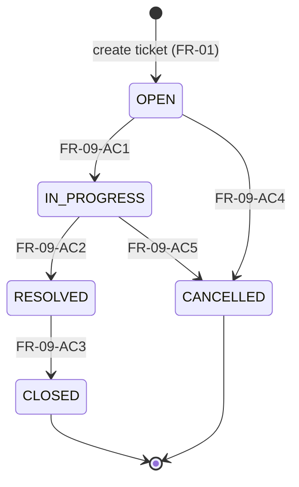

# Ticket Status State Machine

**Document status:** Baselined v1.0 — ready for planning.

## Purpose

Define every ticket status, allowed transitions, and the complete from→to outcome matrix so backend implementation and integration tests (NFR-07) are unambiguous.

## Scope

- In scope: five statuses, transition rules, version/`updatedAt` behaviour on success, HTTP 409 on rejection paths relevant to transitions.
- Out of scope: PATCH field updates (terminal edit rules reference FR-04; see FR-10).

## Content

### States

| Status | Description |
|--------|-------------|
| `OPEN` | Initial state after ticket creation (FR-01-AC1). |
| `IN_PROGRESS` | Work has started on the ticket. |
| `RESOLVED` | Work complete; awaiting closure. |
| `CLOSED` | **Terminal.** Happy-path end state; no outgoing transitions (FR-10). |
| `CANCELLED` | **Terminal.** Withdrawn/cancelled; no outgoing transitions (FR-10). |

New tickets are always created in `OPEN`. Status is not settable on create (CRR-03).

### State diagram

### Allowed transitions table

| From | To | Requirement |
|------|-----|-------------|
| `OPEN` | `IN_PROGRESS` | FR-09-AC1 |
| `OPEN` | `CANCELLED` | FR-09-AC4 |
| `IN_PROGRESS` | `RESOLVED` | FR-09-AC2 |
| `IN_PROGRESS` | `CANCELLED` | FR-09-AC5 |
| `RESOLVED` | `CLOSED` | FR-09-AC3 |

Linear happy path: `OPEN` → `IN_PROGRESS` → `RESOLVED` → `CLOSED`.

Cancellation: `OPEN` → `CANCELLED`; `IN_PROGRESS` → `CANCELLED`.

All other changes of `status` via **PATCH** `/api/v1/tickets/{id}/status` are **rejected** when not allowed below.

### Full 5×5 transition matrix

Rows = **current** status; columns = **requested target** status. Operation: **PATCH** `/api/v1/tickets/{id}/status` with `{ version, status }`. Outcomes: **Allowed** (200 + full TicketDetail, status updated, `version` incremented, `updatedAt` refreshed) or **Rejected 409** (invalid transition `type`; status unchanged). After ticket load, stale `version` → **409** stale-version before transition rules (FR-09-AC9, FR-11-AC2). Request validation failures → **400** before load (decision 13).

| From \ To | OPEN | IN_PROGRESS | RESOLVED | CLOSED | CANCELLED |
|-----------|------|-------------|----------|--------|-----------|
| **OPEN** | Rejected 409 | **Allowed** | Rejected 409 | Rejected 409 | **Allowed** |
| **IN_PROGRESS** | Rejected 409 | Rejected 409 | **Allowed** | Rejected 409 | **Allowed** |
| **RESOLVED** | Rejected 409 | Rejected 409 | Rejected 409 | **Allowed** | Rejected 409 |
| **CLOSED** | Rejected 409 | Rejected 409 | Rejected 409 | Rejected 409 | Rejected 409 |
| **CANCELLED** | Rejected 409 | Rejected 409 | Rejected 409 | Rejected 409 | Rejected 409 |

**Counts (NFR-07-AC2):** 5 **Allowed**, 20 **Rejected 409** (includes 5 same-status pairs on the diagonal).

Same-status examples: `OPEN` → `OPEN` (FR-09-AC6), `CLOSED` → `CLOSED` (FR-10-AC3).

Explicit examples from requirements (all Rejected 409 unless noted):

| Current | Requested | Matrix cell |
|---------|-----------|-------------|
| `CLOSED` | `OPEN` | CLOSED → OPEN |
| `RESOLVED` | `OPEN` | RESOLVED → OPEN |
| `CANCELLED` | `OPEN` | CANCELLED → OPEN |
| `OPEN` | `RESOLVED` | OPEN → RESOLVED |
| `OPEN` | `CLOSED` | OPEN → CLOSED |
| `IN_PROGRESS` | `CLOSED` | IN_PROGRESS → CLOSED |
| `RESOLVED` | `CANCELLED` | RESOLVED → CANCELLED |

### Rules

1. **Same-status:** Transition where current status equals target is **Rejected 409** (invalid transition) (FR-09-AC6).
2. **Terminal states:** `CLOSED` and `CANCELLED` have **no outgoing** allowed transitions (FR-10-AC3); any transition request from these states is **Rejected 409**.
3. **Version required:** Transition request must include current ticket `version`; omission → **400** (FR-09-AC8).
4. **Stale version:** If request `version` does not match persisted `version` → **409** stale version; status unchanged (FR-09-AC9, FR-11-AC2).
5. **Success:** On **Allowed**, persist new status, increment `version`, set `updatedAt` (FR-09-AC1–AC5).
6. **Authority:** Status cannot be changed via general PATCH on `/tickets/{id}` (CRR-03); only via **PATCH** `/api/v1/tickets/{id}/status` (FR-09).

Field updates on terminal tickets are blocked separately (FR-04-AC3, FR-10-AC4)—not part of this matrix but same **409** family with terminal-edit `type`.

### Implementation approach

- **`TicketStatus` enum** (domain) owns allowed targets, e.g. `boolean canTransitionTo(TicketStatus target)` (or equivalent), encoding the matrix above.
- **`TicketService`** (service layer): load ticket by id; validate `version`; if mismatch throw stale-version domain exception; if `!current.canTransitionTo(target)` throw invalid-transition domain exception; else update status, rely on JPA `@Version` increment and set `updatedAt`.
- **`@RestControllerAdvice`** maps domain exceptions to RFC 7807 **409** with the appropriate `type` URI (decision 11).

**Traceability:** FR-09, FR-10, NFR-07; architecture layering in `spec/architecture.md`.

### Test mapping (NFR-07)

| NFR ID | Test approach |
|--------|----------------|
| NFR-07-AC1 | For each of the **5 Allowed** cells, integration test: create ticket in `From` state (or transition setup), **PATCH** `/api/v1/tickets/{id}/status` with matching `version`, assert **200** and target status (and full TicketDetail per FR-09-AC11). |
| NFR-07-AC2 | **Parameterized** integration test over all **25** matrix cells; assert **Allowed** vs **409 invalid transition** per table above; include same-status diagonal cases. |
| NFR-07-AC3 | Suite runs in CI; failure fails build. |

### Additional cases (outside the 5×5 matrix)

Not counted in the 25 matrix cells (NFR-07-AC2). See **FR-09** and requirements **decision 13** (check order: **400** → **404** → **409** stale → **409** domain).

| Case | Outcome |
|------|---------|
| Unknown or invalid target `status` enum in transition body | **400** field error (FR-09-AC10) |
| Missing `version` in transition body | **400** (FR-09-AC8) |
| Stale `version` on an otherwise **Allowed** cell | **409** stale version `type` (FR-09-AC9) |
| Ticket id not found | **404** (CRR-02) |

Use Testcontainers PostgreSQL per `spec/architecture.md` ADR-005.

## Open Questions

None.

## Change Log

| Date | Version | Author | Summary |
|------|---------|--------|---------|
| 2026-09-30 | 0.1.0 | — | Initial SSOT: states, diagram, allowed table, 5×5 matrix, rules, implementation and NFR-07 test mapping. |
| 2026-09-30 | 0.1.1 | — | Additional cases outside 5×5 matrix (400/404/409); links to FR-09. |
| 2026-09-30 | 1.0.0 | — | PATCH status endpoint; NFR-07 wording; decision 13 order; baselined v1.0. |
