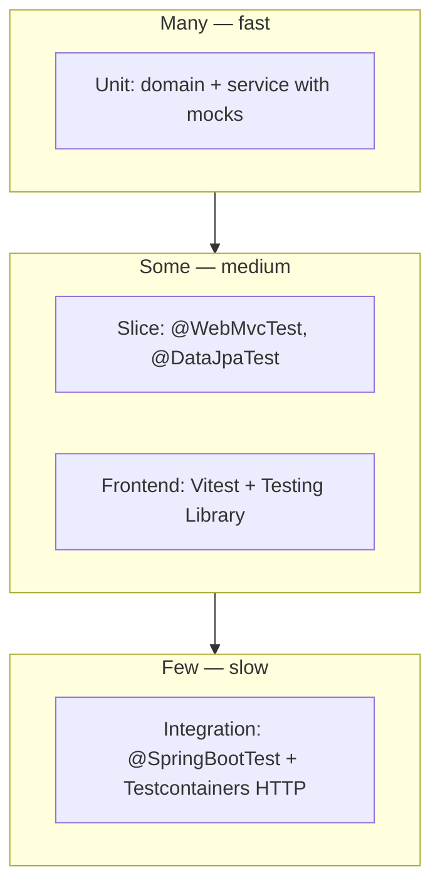

# Test Strategy — Support Ticket Management System

**Document status:** Baselined v1.0 — ready for planning.

## Purpose

Define how automated and manual tests verify requirements across backend and frontend, including tools, layering, and traceability expectations.

## Scope

- In scope: test pyramid, backend unit/integration/API tests, frontend component tests, CI expectations, FR/NFR mapping.
- Out of scope: load testing, security scanning, E2E browser farms (optional future layer).

## Content

### Test pyramid

| Layer | Goal | Tools (per testing.mdc / architecture) |
|-------|------|----------------------------------------|
| Unit | Domain rules and service orchestration in isolation | JUnit 5, AssertJ, Mockito |
| Slice | HTTP contract, validation JSON, persistence queries | `@WebMvcTest`, `@DataJpaTest`, MockMvc, AssertJ |
| Integration | Real HTTP + PostgreSQL + Flyway; NFR-07 matrix | `@SpringBootTest`, Testcontainers PostgreSQL, RestTestClient or MockMvc full stack |
| Frontend component | Forms, list states, error mapping | Vitest, React Testing Library |
| Manual exploratory | End-to-end smoke in browser | Optional checklist before demo; not a CI gate for POC |

**Naming:** `methodName_condition_expectedResult`. Structure: Arrange / Act / Assert. One behaviour per test.

**Policy:** Never weaken or delete a failing test to green the build; fix production code or escalate (testing.mdc).

---

### Backend tests

#### Unit — domain (`TicketStatus`, etc.)

| Target | What to verify | Requirements |
|--------|----------------|--------------|
| **`TicketStatus`** | `canTransitionTo` (or equivalent) matches **5 allowed** and **20 rejected** pairs in `spec/state-machine.md`; same-status returns false | FR-09, NFR-07, state-machine.md |
| **Terminal helpers** | `CLOSED` / `CANCELLED` have no outgoing transitions | FR-10 |
| **Enums** | `TicketPriority` values if validation helpers exist | FR-01 |

Use **parameterized** JUnit tests for the 5×5 matrix at unit level (fast feedback); integration suite still exercises HTTP (NFR-07-AC2).

#### Unit — service layer

| Target | What to verify | Requirements |
|--------|----------------|--------------|
| **TicketService** (or equivalent) | Create defaults (OPEN, version 0, MEDIUM); PATCH merges fields, increments version; terminal PATCH throws terminal exception; stale version throws stale exception | FR-01, FR-04, FR-10, FR-11 |
| **Transition path** | Allowed transition updates status; disallowed throws invalid-transition; check order: validation → not found → stale → domain (decision 13) | FR-09, decision 13 |
| **Comments** | Add comment without bumping ticket version | FR-05-AC1 |

Mock repositories; assert exception types mapped later in advice tests.

#### Slice — controllers (`@WebMvcTest`)

| Area | Examples | Requirements |
|------|----------|--------------|
| POST `/tickets` | 201 + Location + body shape; 400 unknown fields; validation errors shape | FR-01, CRR-03, CRR-04, api-contract |
| GET `/tickets` | Default pagination; invalid `sort` → 400; `q` + `status` combined | FR-06–FR-08 |
| GET `/tickets/{id}` | 404; comments array present | FR-03, CRR-02 |
| PATCH `/tickets/{id}` | 409 terminal; 409 stale; version-only → 400 | FR-04, FR-11 |
| PATCH `/tickets/{id}/status` | 200 full detail on success; 409 invalid transition | FR-09 |
| POST comments | 201 Comment body; 404 ticket | FR-05 |

Assert RFC 7807: `type`, `status`, `errors` for 400; correct `/problems/*` suffix for 409 variants (NFR-02).

#### Slice — repositories (`@DataJpaTest`)

| Area | Examples | Requirements |
|------|----------|--------------|
| Search | Case-insensitive substring; `%` / `_` literal; trim keyword | FR-06 |
| Filter + search | Status AND keyword | FR-06-AC4, FR-07 |
| Comments | Ordered by `created_at` ascending for ticket id | FR-03-AC2 |

Use test entities or `@Sql` fixtures; Flyway or test schema per project config (`spec/architecture.md`).

#### Integration — full stack (NFR-07)

| Suite | What to verify | Requirements |
|-------|----------------|--------------|
| **Allowed transitions** | Five cases: POST setup then PATCH status with matching `version` → 200 and target status | NFR-07-AC1, FR-09-AC1–AC5 |
| **Full 5×5 matrix** | Parameterized: each from→to; expect 200 only on allowed cells, else 409 invalid-transition (after version sync) | NFR-07-AC2 |
| **Same-status diagonal** | 409 invalid-transition | FR-09-AC6 |
| **Stale version** | Two sequential updates; second with old version → 409 stale-version | FR-11, FR-09-AC9 |
| **Persistence** | Optional automated: create ticket + comment, re-read in same Testcontainers session | NFR-01 (optional) |

Run against Testcontainers PostgreSQL; **`test` profile**; failures fail CI build (NFR-07-AC3).

#### Check order (decision 13) — `@WebMvcTest` and integration

| Case | Expected HTTP |
|------|-----------------|
| Valid body, ticket id not found (e.g. POST comment, PATCH field/status) | **404** |
| Invalid body (e.g. missing `author`), ticket id not found | **400** |
| PATCH fields on terminal ticket with **stale** `version` | **409** stale-version |
| PATCH fields on terminal ticket with **current** `version` | **409** terminal-ticket |

Traceability: decision 13, FR-04-AC3, FR-11, api-contract examples.

#### NFR-01 — persistence across restart (manual, required)

Before release/demo, run the **required** manual acceptance (NFR-01-AC2):

1. Start stack via Docker Compose; create at least one ticket and comment via API or UI.
2. Restart PostgreSQL container, then backend container (graceful stop/start).
3. GET ticket and comments; content unchanged.

Automated persistence test in CI is **optional** and not a merge gate for the POC.

#### Backend traceability matrix (summary)

| Requirement area | Primary test layer |
|------------------|-------------------|
| FR-01 create | WebMvcTest + integration |
| FR-02–FR-08 list/search | WebMvcTest + DataJpaTest + integration |
| FR-03 detail | WebMvcTest + DataJpaTest |
| FR-04 PATCH | Unit service + WebMvcTest |
| FR-05 comments | WebMvcTest + integration |
| FR-09 transitions | TicketStatus unit + integration matrix |
| FR-10 terminal | WebMvcTest + unit |
| FR-11 locking | Unit + integration |
| NFR-02 validation shape | WebMvcTest |
| NFR-07 state machine | Integration parameterized |

---

### Frontend tests

**Approach (resolves requirements §7 deferral):** **Automated component tests** for critical behaviour; **manual smoke** for full browser flows (create → detail → transition → comment) before release/demo. No mandatory Playwright/Cypress in POC scope.

| Component / flow | Test focus | Requirements |
|------------------|------------|--------------|
| List | Renders rows from mocked GET; empty state; debounced search calls API with `q` | FR-12-AC2, AC6, AC7 |
| Create form | Submit calls POST; navigates on 201; shows field errors on 400 | FR-12-AC1, AC9 |
| Detail | Renders comments order; PATCH includes `version`; status buttons match `allowedTransitions` | FR-12-AC3, AC4, AC8 |
| Terminal detail | Inputs/buttons disabled; comment form enabled | FR-12-AC14 |
| Error mapping | Mock 409 stale → banner + reload; 404 → not-found copy | FR-12-AC10–AC13, NFR-03 |

Use MSW or mocked fetch/TanStack Query clients; assert accessible roles/labels (Testing Library).

---

### CI and coverage expectations

- **Must pass:** Backend unit + slice + integration (including NFR-07 matrix); frontend `vitest run`.
- **Coverage:** No hard percentage gate for POC; prioritize FR/NFR-listed behaviours and error shapes.
- **Traceability:** Test class or `@DisplayName` should reference FR/NFR ids where practical (NFR-05-AC2).

---

### Manual test checklist (optional)

1. Create ticket from UI → lands on detail (FR-12-AC1).
2. Search and filter list (FR-12-AC6, AC7).
3. Edit fields and transition OPEN → IN_PROGRESS → RESOLVED → CLOSED (FR-12-AC8).
4. Open terminal ticket: cannot edit; can comment (FR-12-AC14).
5. Two tabs: stale edit shows reload banner (FR-12-AC13).
6. **NFR-01-AC2:** Docker Compose restart (DB + backend); data still present.

## Open Questions

None.

## Change Log

| Date | Version | Author | Summary |
|------|---------|--------|---------|
| 2026-09-30 | 0.1.0 | — | Initial test strategy: pyramid, backend/frontend layers, NFR-07 integration, UI test approach deferral resolved. |
| 2026-09-30 | 1.0.0 | — | Decision 13 check-order tests; NFR-01 manual required / automated optional; baselined v1.0. |
