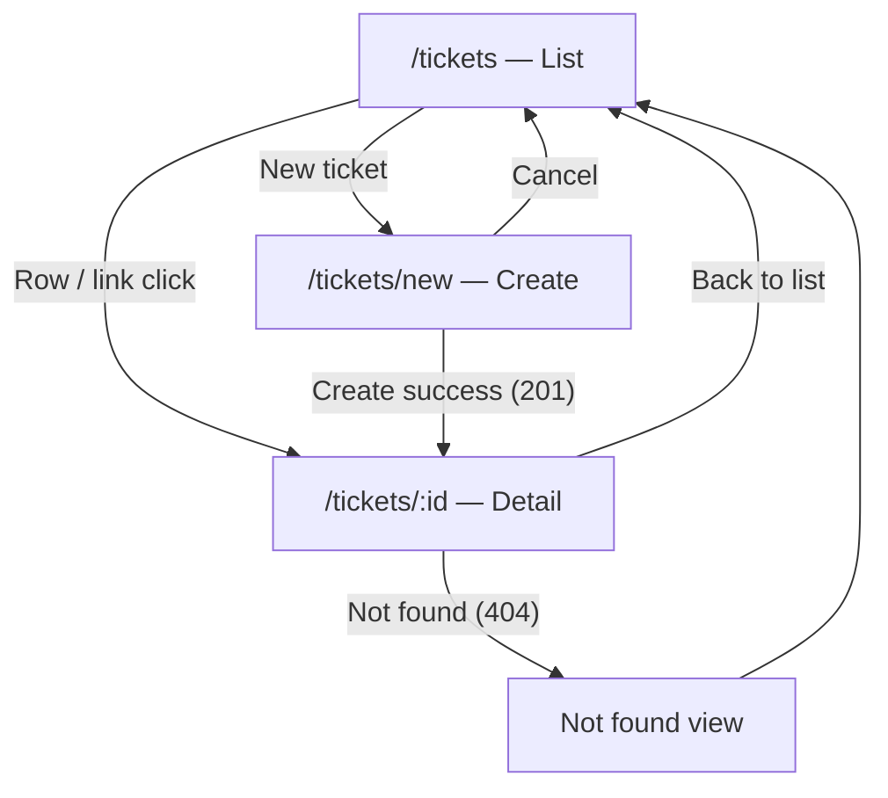

# UI Flow — Support Ticket Management System

**Document status:** Baselined v1.0 — ready for planning.

## Purpose

Describe routes, screens, user actions, API usage, loading/empty/error behaviour, and error presentation so the React SPA implements FR-12 consistently with the backend.

## Scope

- In scope: three primary routes, list/search/filter/create/detail/comment/transition flows, Problem Details mapping to UI copy and placement.
- Out of scope: visual design system, auth, routing library configuration details.

## Content

### Routes

| Route | Screen | FR-12 |
|-------|--------|-------|
| `/tickets` | Ticket list (search, filter, pagination) | FR-12-AC2, AC6, AC7 |
| `/tickets/new` | Create ticket form | FR-12-AC1 |
| `/tickets/:id` | Ticket detail (edit, transitions, comments) | FR-12-AC3–AC5, AC8, AC14 |

Parameter `:id` must be a positive integer string. **Non-numeric** `:id` shows the same **“Ticket not found”** view as HTTP 404 **without** calling the API. Missing ticket after a valid id uses GET and the API **404** response.

### Navigation flow

### Global UI conventions

- **Data fetching:** TanStack Query against `/api/v1` (see `spec/architecture.md`); dev proxy from Vite to backend.
- **Validation:** Client may show hints (length, required fields) for faster feedback; **backend is authoritative** (NFR-02, FR-12-AC9).
- **Optimistic locking:** Detail edit and status actions send the `version` from the last loaded ticket; on stale-version conflict, show banner with reload (FR-12-AC13).
- **Terminal tickets (`CLOSED`, `CANCELLED`):** Field inputs and status action buttons **disabled**; comment form **enabled** (FR-12-AC14, FR-10).

---

### Screen: Ticket list (`/tickets`)

**Components (logical):**

- Page header with title and **New ticket** button → navigates to `/tickets/new` (FR-12-AC2).
- **Search box** — binds to `q`; debounced (~300 ms) refetch of list (FR-12-AC6).
- **Status filter** dropdown — single value or “All”; maps to `status` query param when not “All” (FR-12-AC7).
- **Ticket table or list** — columns at minimum: title, status, priority, assignee, updatedAt (FR-12-AC2).
- **Pagination** controls — `page`, `size` (default 20); display total from `totalElements` / `totalPages` (FR-08).

**Data loaded:**

- `GET /api/v1/tickets?q=&status=&page=&size=&sort=createdAt,desc` (default sort per api-contract).

**User actions → API:**

| Action | API |
|--------|-----|
| Initial load / change page / change size | GET `/tickets` with current query |
| Type in search (debounced) | GET `/tickets` with trimmed `q` |
| Change status filter | GET `/tickets` with `status` or omit |
| Open ticket | Navigate to `/tickets/:id` (no API until detail mount) |
| New ticket | Navigate to `/tickets/new` |

**States:**

| State | Behaviour |
|-------|-----------|
| Loading | Skeleton or spinner; disable pagination actions |
| Empty (`content.length === 0`, 200) | Message such as “No tickets match your filters.” — not an error (FR-02-AC2) |
| Error (400 on bad filter/sort) | Inline or banner: show `detail` from Problem Details; reset invalid filter if needed |
| Error (network / 500) | Generic retry message (see error mapping) |

**Traceability:** FR-12-AC2, AC6, AC7; FR-02, FR-06, FR-07, FR-08.

---

### Screen: Create ticket (`/tickets/new`)

**Components:**

- Form: **title**, **description** (required); **priority** (select, default MEDIUM); **assignee** (optional text).
- Submit, Cancel (back to list).
- Field-level error display area per input.

**Data loaded:** None (static form defaults).

**User actions → API:**

| Action | API |
|--------|-----|
| Submit valid form | POST `/api/v1/tickets` |
| Cancel | Navigate to `/tickets` |

**Success (FR-12-AC1):** On **201**, read `id` from body (and/or `Location`), navigate to `/tickets/:id`.

**States:**

| State | Behaviour |
|-------|-----------|
| Submitting | Disable submit; show pending indicator |
| Validation 400 | Map `errors[]` to fields (FR-12-AC9) |
| Network / 500 | Generic retry message |

**Traceability:** FR-12-AC1, AC9; FR-01.

---

### Screen: Ticket detail (`/tickets/:id`)

**Components:**

- **Header** — ticket id, status badge, link back to list.
- **Editable fields form** — title, description, priority, assignee; **Save** sends PATCH with current `version` (FR-12-AC4). Disabled when terminal (FR-12-AC14).
- **Status actions** — one button per entry in `allowedTransitions` from last GET (FR-12-AC8); labels human-readable (e.g. “Start progress” → `IN_PROGRESS`). Disabled when terminal or while request in flight.
- **Comments** — read-only list ordered ascending by `createdAt` (FR-12-AC3); **Add comment** form (author, body) always enabled (FR-12-AC5, AC14).

**Data loaded:**

- `GET /api/v1/tickets/{id}` on mount and after successful PATCH, transition, or optional reload after stale conflict.

**User actions → API:**

| Action | API |
|--------|-----|
| Load / reload | GET `/tickets/{id}` |
| Save field changes | PATCH `/tickets/{id}` with `{ version, ...changed fields }` |
| Status button | PATCH `/tickets/{id}/status` with `{ version, status: target }` |
| Add comment | POST `/tickets/{id}/comments` with `{ author, body }`; on 201 append comment to list or refetch detail |

**Success:**

- PATCH field / status → replace local ticket state from **200** body (includes new `version`, `allowedTransitions`, `status`).
- POST comment → append returned Comment or refetch GET detail.

**States:**

| State | Behaviour |
|-------|-----------|
| Loading | Full-page or section spinner |
| Not found 404 | Dedicated **“Ticket not found”** view with link back to `/tickets` (FR-12-AC10) |
| Terminal | Forms/buttons disabled as above; comments active (FR-12-AC14) |
| Stale 409 | Banner (FR-12-AC13) |
| Invalid transition / terminal edit 409 | Banner (FR-12-AC11, AC12) |

**Traceability:** FR-12-AC3–AC5, AC8, AC11–AC14; FR-03–FR-05, FR-09, FR-04.

---

### Error display mapping (Problem Details → UI)

Parse `type` suffix or full URI; prefer matching on path suffix `/problems/...`.

| Problem type | HTTP | UI treatment | User-facing copy (guidance) | FR-12 |
|--------------|------|--------------|-------------------------------|-------|
| `/problems/validation-error` | 400 | Field errors under inputs; query param errors on list near filter/search | Use each `errors[].message`; fallback `detail` | AC9 |
| `/problems/not-found` | 404 | Full not-found page on detail route | **“Ticket not found”** + link to list | AC10 |
| `/problems/stale-version` | 409 | Banner on detail (edit/transition) | **“This ticket was updated elsewhere. Reload to see the latest version, then try again.”** + **Reload** button (refetch GET) | AC13 |
| `/problems/invalid-transition` | 409 | Banner on detail | Show backend `detail` (e.g. transition not allowed from current status) | AC11 |
| `/problems/terminal-ticket` | 409 | Banner if user somehow submits edit on terminal | Show backend `detail` (e.g. cannot edit closed/cancelled ticket) | AC12 |
| `/problems/internal-error` | 500 | Banner or toast | **“Something went wrong. Please try again.”** — no internal text | NFR-03 |
| Network failure / no response | — | Banner or toast | **“Unable to reach the server. Check your connection and try again.”** | NFR-03 |

List screen: **404** is not expected for GET list; **400** for bad `status`/`sort`/`page`/`size` shows banner with `detail` and field errors if present.

Create/detail forms: map `errors[].field` to inputs (`title`, `description`, `priority`, `assignee`, `author`, `body`, `version` if ever returned).

---

### FR-12 acceptance criteria traceability

| AC | UI behaviour |
|----|----------------|
| FR-12-AC1 | Create form → POST → navigate to `/tickets/:id` |
| FR-12-AC2 | List loads GET `/tickets` defaults |
| FR-12-AC3 | Detail shows fields + comments chronological |
| FR-12-AC4 | Save PATCH with `version` |
| FR-12-AC5 | Comment POST → thread updates |
| FR-12-AC6 | Debounced search → `q` |
| FR-12-AC7 | Status dropdown → `status` |
| FR-12-AC8 | Buttons from `allowedTransitions`; includes RESOLVED → CLOSED |
| FR-12-AC9 | 400 field errors |
| FR-12-AC10 | 404 not-found page |
| FR-12-AC11 | invalid-transition banner |
| FR-12-AC12 | terminal-ticket banner |
| FR-12-AC13 | stale-version banner + Reload |
| FR-12-AC14 | Terminal: disable edit/transition; comments enabled |

## Open Questions

None.

## Change Log

| Date | Version | Author | Summary |
|------|---------|--------|---------|
| 2026-09-30 | 0.1.0 | — | Initial UI flow: routes, Mermaid navigation, per-screen behaviour, error mapping, FR-12 traceability; resolves requirements §7 UI deferrals. |
| 2026-09-30 | 1.0.0 | — | Non-numeric route id → not-found without API; baselined v1.0. |
